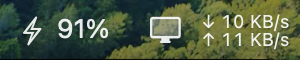

# DisplayHelper

A macOS menu-bar utility that keeps your display awake and your system marked
**active** while you are away from the keyboard.


A single monochrome glyph that adapts to light and dark. It looks identical
whether the toggle is on or off — state lives in the dropdown, never as a
colour tell in the bar.

Two things are happening at once, and the difference matters:

- **Keeping the screen on** — a held `caffeinate` process stops the display and
  system from sleeping.
- **Keeping you "not idle"** — a periodic synthetic keypress resets the system
  idle timer, so anything reading idle time sees recent activity.

Plain `caffeinate` only does the first. Screen savers, lock-on-idle, and
presence indicators in chat and collaboration apps read the *idle timer*, and a
`caffeinate`d Mac still goes idle by that measure. DisplayHelper addresses both.

No Dock icon, no window — it runs as an `.accessory` app and lives entirely in
the menu bar. Pure Cocoa, no third-party dependencies.

## What it's for

- Long builds, downloads, renders, or test runs you want to watch without the
  screen dimming every few minutes
- Reading, watching, or presenting something without touching the trackpad
- Keeping a machine reachable and awake during remote sessions
- Any workflow where the display sleeping mid-task is disruptive

**Be straight with yourself about this one:** the idle-timer nudge also
suppresses the away/idle status that presence-aware apps report. If your
workplace treats that indicator as a signal about working hours, using this to
appear present while you are not is the kind of thing that damages trust badly
when it comes out. Keeping a screen awake during a build is the intended use.

## How it works

```
menu bar toggle ──► start()
                     ├── spawn /usr/bin/caffeinate -dimsu   (held for the session)
                     └── Timer, every 30s ──► tick()
                                                └── idle >= 240s? post F15 down/up
```

**Sleep prevention.** `start()` launches
`/usr/bin/caffeinate -dimsu -w <own pid>` as a child process and holds the
handle. The flags assert, in order: **d** display sleep, **i** idle sleep,
**m** disk sleep, **s** system sleep on AC power, and **u** user-active.
Turning the toggle off calls `terminate()` on it, so the assertion is released
immediately rather than lingering.

`-w` is what makes that safe. It tells `caffeinate` to watch this process and
exit when it does. A child process is *not* killed with its parent on macOS —
it is reparented to `launchd` and runs on — so without `-w` a force-quit, which
never reaches `terminate()`, would leave the display pinned awake with no UI
left to switch it off. The app also installs a `terminationHandler`: if
`caffeinate` is killed from outside, the toggle flips itself back to Off rather
than continuing to report a hold it no longer has.

**Idle-timer reset.** Every `CHECK_EVERY` seconds the timer fires `tick()`,
which reads the true idle time via
`CGEventSource.secondsSinceLastEventType(.combinedSessionState, ...)`. Only once
that crosses `IDLE_THRESHOLD` does it post a paired **F15** key-down and key-up
through `.cghidEventTap`.

Two deliberate choices there:

- **F15 (key code 113)** because it is a no-op on ordinary keyboards — no
  modifier state, no text inserted, nothing focused or scrolled. Compare
  Shift, which lights up as a modifier, or arrow keys, which move a cursor
  through whatever window happens to be frontmost.
- **Threshold, not a metronome.** The keypress fires only when you are actually
  idle. While you are using the machine, nothing is injected at all.

The timer is added in `.common` run-loop mode, so it keeps firing while menus
are open rather than stalling in tracking mode.

State is intentionally invisible from the bar itself — the glyph never changes
colour. Whether it is on shows in the dropdown, as both a checkmark and a
`Status: On` / `Status: Off` line.

## Requirements

- macOS 13 or later
- Xcode command line tools (`xcode-select --install`) for `swiftc`
- **Accessibility permission** — required, see below

## Setup

### Build

```bash
./build.sh
open dist/DisplayHelper.app
```

`build.sh` produces a universal (arm64 + x86_64) release binary, wraps it in
`dist/DisplayHelper.app` using `Resources/Info.plist`, and ad-hoc signs it.

Install it with:

```bash
cp -R dist/DisplayHelper.app ~/Applications/
```

The bundle matters: `LSUIElement` keeps it out of the Dock, and the
Accessibility permission below is granted to a bundle identity
(`local.displayhelper`) rather than to a loose binary — running the bare
executable will not pick up the grant.

### Grant Accessibility access

Posting synthetic key events requires it, and **without it the app runs but the
idle nudge silently does nothing** — `caffeinate` still works, so the screen
stays on while the idle timer keeps climbing. If the behaviour seems half-broken,
check here first:

**System Settings → Privacy & Security → Accessibility** → enable DisplayHelper.

After granting it, quit and relaunch the app.

### Launch at login

System Settings → General → Login Items → **+** → select the app in
`~/Applications`.

## Menu

| Item | Behaviour |
|---|---|
| `Status: On` / `Status: Off` | Current state, non-clickable |
| **Keep Display Awake** | Toggles; checkmark reflects state |
| **Quit** (`⌘Q`) | Stops cleanly, releasing `caffeinate` first |

## Tuning

Constants at the top of `main.swift` — edit and rebuild:

| Constant | Default | Meaning |
|---|---|---|
| `IDLE_THRESHOLD` | `240` | Seconds idle before nudging (4 min) |
| `CHECK_EVERY` | `30` | How often to check idle time, in seconds |
| `F15_KEYCODE` | `113` | Key code posted as the no-op nudge |

Keep `CHECK_EVERY` comfortably below `IDLE_THRESHOLD`; the check only has effect
when it lands after the threshold has been crossed.

## Notes and limitations

- **`-s` only applies on AC power.** On battery, macOS overrides the system-sleep
  assertion. Display sleep (`-d`) is still prevented either way.
- **Settings are not persisted.** The toggle starts **Off** on every launch, by
  design — it should not silently keep your Mac awake after a reboot you forgot
  about.
- **No login-item registration in-app.** Unlike NetSpeedBar, this one has no
  `SMAppService` support; use System Settings as above.
- **A force-quit is handled**, via `caffeinate -w` as described above. To check
  what is actually being held at any time, `pmset -g assertions` lists every
  live assertion — look for `PreventUserIdleDisplaySleep`.
- **If `caffeinate` is killed externally**, the toggle drops back to Off rather
  than lying about being on. It does not restart it automatically: a repeatedly
  dying helper should be visible, not papered over.

## See also

One of three small macOS menu-bar utilities, shown here running side by side:



- [NetSpeedBar](https://github.com/joyal670/NetSpeedBar) — live download and upload speed
- [DisplayHelper](https://github.com/joyal670/DisplayHelper) — keeps the display awake and the system marked active  ← *you are here*
- [PowerToggleBar](https://github.com/joyal670/PowerToggleBar) — one-click battery saver with exact restore

## License

MIT — see [LICENSE](LICENSE).
